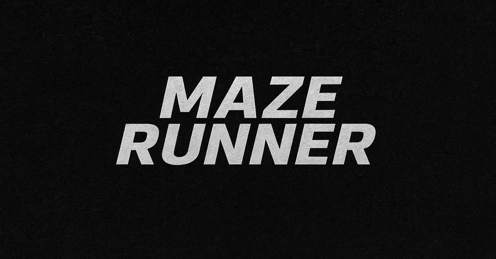

# Maze Runner




Download: `Downloadable.zip` is included in this repository for quick access to a packaged build and runtime files.

## Overview

Maze Runner is an interactive maze generator and pathfinding visualizer built with C++, OpenGL and ImGui. It supports multiple maze generation algorithms, pathfinding solvers, obstacle injection, and step-by-step visualization of the solving process.

This README documents the codebase layout, the implemented algorithms & techniques, controls, build and run instructions, and notes about customization.

## Highlights / Features
- Three maze generation algorithms: Backtracker (recursive backtracker), Randomized Prim, and Kruskal (DSU / minimum spanning tree).
- Four solvers: Depth-First Search (DFS), Breadth-First Search (BFS), Dijkstra, and A* (Manhattan heuristic).
- Interactive ImGui-based UI with live control over grid size, algorithms, speed, step mode, obstacles, and more.
- Visualization of solver exploration (success/failure edges), and final path rendering.
- Obstacle randomization with a density slider and logic that attempts to preserve at least one path.
- Start/end placement logic that chooses opposite corners and ensures multiple pathways around them for better solves.


## Implemented Algorithms (what's in the code)

Generation (src/modules/maze_generation.cpp & src/headers/maze_generation.h)
- Backtracker (Recursive Backtracker)
	- Standard depth-first search carving algorithm. Starts from a random cell and walks to random unvisited neighbors, backtracking when stuck. Produces long winding passages and a perfect maze (single path between any two cells) before optional loop additions.
- Prim's Algorithm (Randomized Prim)
	- Treats the maze as a graph frontier. Picks random frontier edges to carve and grows the maze outward. Produces mazes with a different texture from backtracking (more evenly mixed passages).
- Kruskal's Algorithm
	- Uses a Disjoint Set Union (DSU) structure (see `DSU` in `src/modules/maze_generation.cpp`) to create a minimum-spanning-tree-like maze by considering all edges in random order and uniting different components.

Additional generation features
- addMazeComplexity(): opens a small number of extra walls to introduce loops (makes the maze not strictly perfect and gives alternate routes).
- ensureMultiplePathways(): creates several pathways around the start and end cells (the code attempts to leave >=7 connections) so that start/end are not isolated and solving is interesting.

Obstacles
- `randomizeObstacles(float density)` will attempt to place obstacles according to the requested density while preserving connectivity (the implementation finds paths from start to end and tries not to block them all — expensive on large grids).

Solvers (src/modules/solvers.cpp & src/headers/solvers.h)
- Depth-First Search (DFS)
	- A recursive exploration that records events pushed during the search so the UI can animate exploration and backtracking.
- Breadth-First Search (BFS)
	- Classic shortest-path on an unweighted grid. Records parent pointers to reconstruct the shortest path and marks exploration events for visualization.
- Dijkstra
	- Standard Dijkstra using a priority queue (implemented with std::priority_queue and greater comparator). In this code edges are unit-weight (w=1), so it behaves like BFS for weights=1 but uses the Dijkstra framework and shows weights in events.
- A* (A-Star)
	- A* with Manhattan distance heuristic (|dx|+|dy|). Uses gScore/fScore and a priority queue to guide search toward the goal.

Visualization details
- The solvers push exploration events to an `events` list (u, v, ok, weight) that the UI consumes to animate exploration.
- `successVertices` and `failureVertices` are built to show traversed/failing edges visually.
- Step Mode lets you step through events one at a time; otherwise, events are animated automatically according to the speed multiplier.

## Code Structure (high level)

- include/ — third-party headers and libraries (stb_image.h, glad headers, GLFW headers, GLM headers, ImGui headers)
- assets/ — images, icons, and fonts used by the UI. Replace or add images here (e.g., window icon `assets/logo.png`).
- lib/ — prebuilt static libraries (contains `libglfw3dll.a` used in linking)
- src/
	- new.cpp — application entrypoint, UI, event loop, and wiring between modules (main window, ImGui controls etc.)
	- dependancies/ — bundled source for third-party dependencies (ImGui, glad)
	- headers/ — internal headers used by the project (common.h, logging.h, maze_generation.h, rendering.h, shaders.h, solvers.h, textures.h)
	- modules/ — core implementation files
		- globals.cpp — global state like grid, start/end, gCols/gRows
		- logging.cpp — simple logging wrapper (logs to `maze_runner.log`)
		- maze_generation.cpp — generation implementations (Backtracker, Prim, Kruskal) and helpers
		- solvers.cpp — DFS, BFS, Dijkstra, A* and visualization event queues
		- rendering.cpp — OpenGL rendering helpers and VAO/VBO building for walls/paths
		- shaders.cpp — shader sources and program creation
		- textures.cpp & stb_image_impl.cpp — texture loading and management

## Key files and functions to look at
- `src/modules/maze_generation.cpp`
	- generateBacktracker(), generatePrim(), generateKruskal(), addMazeComplexity(), ensureMultiplePathways(), randomizeObstacles()
- `src/modules/solvers.cpp`
	- solveDFS(), solveBFS(), solveDijkstra(), solveAStar(), pushEvent(), resetAnimationBuffers()
- `src/new.cpp`
	- UI controls (ImGui), grid configuration, speed/step controls, and the main loop that triggers generators and solvers.

## Controls & UI (what you can do in-app)
- Grid size: slider for columns/rows (apply to regenerate)
- Generation algorithm: select Backtracker / Prim / Kruskal and click Generate
- New Start/End Points: randomly choose start and end (from corners)
- Obstacles: density slider + "Random Obstacles" and "Clear"
- Solver: choose DFS / BFS / Dijkstra / A*
- Speed: speed multiplier for automatic animation
- Step Mode: toggle to step through events manually with Step button
- Start / Pause / Reset Run: control the solver visualization and timing
- Clear Visualization: remove success/failure overlay while leaving the maze intact

## Build & Run (Windows - PowerShell)

Prerequisites
- A working C++ toolchain (g++ / MinGW or MSYS). This project was compiled with g++ in a tasks.json entry.
- `glfw3.dll` (runtime) must be available next to the executable (the repo already contains `glfw3.dll`).

Quick build using the provided g++ command (the project uses plain C++ + OpenGL + ImGui):

```powershell
g++ -o MazeRunner.exe src/new.cpp src/modules/globals.cpp src/modules/logging.cpp src/modules/textures.cpp src/modules/stb_image_impl.cpp src/modules/shaders.cpp src/modules/maze_generation.cpp src/modules/solvers.cpp src/modules/rendering.cpp src/dependancies/glad.c src/dependancies/imgui*.cpp -Iinclude -Iinclude/imgui -Llib -lglfw3dll -lopengl32 -lgdi32
```

Or use the provided VS Code task `build maze runner` / `build modular maze runner` (see `.vscode/tasks.json` if present) to run the same compile command.

After building, run the executable:

```powershell
.\MazeRunner.exe
```

If you prefer, extract `Downloadable.zip` which may already contain a prebuilt `MazeRunner.exe` and the `glfw3.dll` runtime.

## Performance notes
- Large grids (e.g., > 100x100) can be slow for expensive operations like exhaustive path enumeration in `randomizeObstacles()` — the code recursively finds all paths from start to end before picking obstacle placements.
- Solvers are fast for typical grid sizes (DFS/BFS/A*/Dijkstra) but visualizing every exploration event can make the animation long; use the speed slider.

## Extending the project
- Add more generation algorithms (e.g., Wilson's algorithm, Eller’s algorithm) by adding functions to `src/modules/maze_generation.cpp` and exposing them in `src/headers/maze_generation.h`.
- Add weighted edges and custom obstacle costs to test weighted pathfinding with Dijkstra/A*.
- Improve obstacle generation to use faster heuristics or randomized local modifications rather than exhaustive path enumeration.

## Troubleshooting
- If the window fails to create, ensure your graphics drivers support OpenGL 3.3+. The code falls back to OpenGL 3.0 if 3.3 creation fails.
- If fonts or textures fail to load, check working directory and paths under `assets/`.
- If the app crashes immediately, run `MazeRunner.exe` from PowerShell to see console logs (the app opens a console on Windows when no console exists) and inspect `maze_runner.log`.


